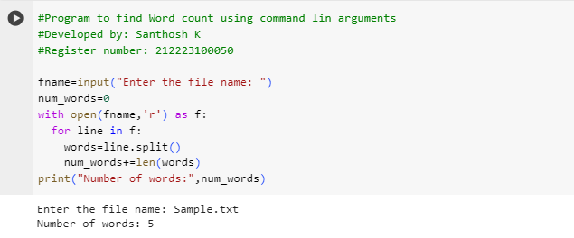

# command-line-arguments-to-count-word
## AIM:
To write a python program for getting the word count from the contents of a file using command line arguments.
## EQUIPEMENT'S REQUIRED: 
PC
Anaconda - Python 3.7
## ALGORITHM: 
### Step 1:


### Step 2: 
 
### Step 3: 

### Step 4:  

### Step 5: 

### Step 6: 

## PROGRAM:
```
#Program to find the Word count using command line arguments
#Developed by: Santhosh K
#Register number: 212223100050

fname=input("Enter the file name: ")
num_words=0
with open(fname,"r") as f:
    for line in f:
    words=line.split()
    num_words+=len(words)
print("Number of words:",num_words)
```
### OUTPUT:


## RESULT:
Thus the program is written to find the word count from the contents of a file using command line arguments.
